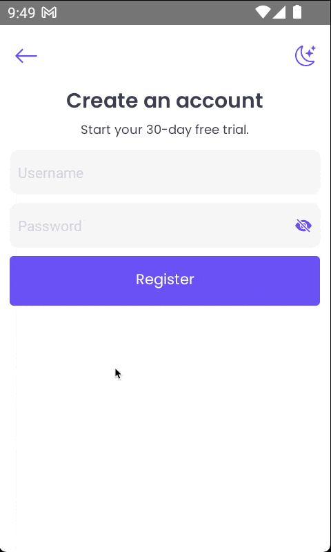
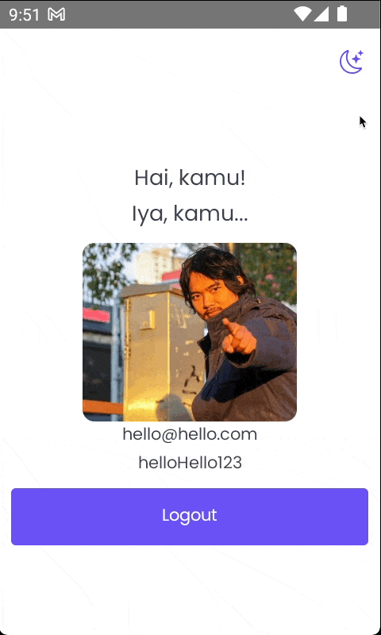
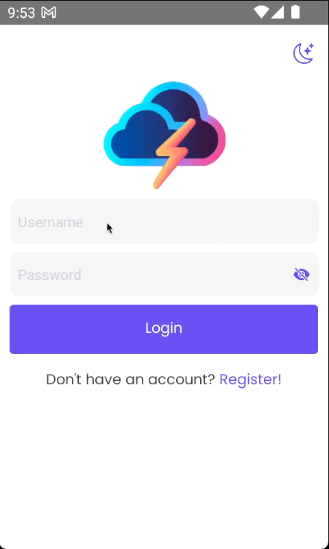
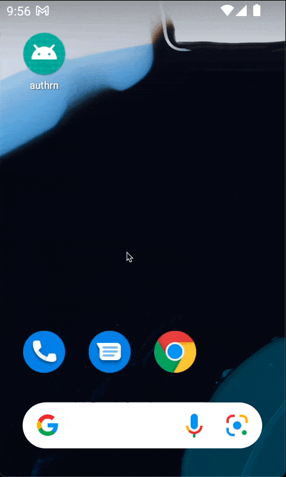

<h1 align="center">
        
</h1>

React Native Authentication Screen Sample

 

## Table of Contents

- [Tech Stack](#tech-stack)
- [Features](#features)
- [Download](#download-apk)
- [Demo](#demo)

## Tech Stack

- React Native
- Jest
- React Testing Library 🐐
- React Native SVG
- React Native Encrypted Storage
- Zustand 🐻
- Github Actions

## Features

- Validate email & password using regex
  - Email
  - Password - Min 8 characters, contains at least 1 uppercase letter, 1 lowercase letter, and 1 number
- Dark mode 🌙
- Sessions are stored & maintained using react native encrypted storage
- SVG icons
- Testing with Jest & React Native Testing Library 🐐
- Global state management with zustand 🐻
- Automatically test & build Android (APK) with github actions 🚀

## Download APK

- Go to [Actions](https://github.com/yogiw/rn-auth-sample/actions)
- Last successful workflow (with green checkmark)
- Artifacts
- release

## Demo

| Flow                                                                                                         | Demo                                                 |
| ------------------------------------------------------------------------------------------------------------ | ---------------------------------------------------- |
| Dark mode toggle in register screen                                                                          |          |
| Dark mode toggle in login screen                                                                             |                |
| Dark mode toggle in home screen                                                                              |                  |
| Login                                                                                                        |               |
| Register                                                                                                     |         |
| Login screen → register screen → back button - back to login screen → home screen → back button → app closed |    |
| Open app → home screen (session persisted) → logout → login screen → back button → app closed                |  |
